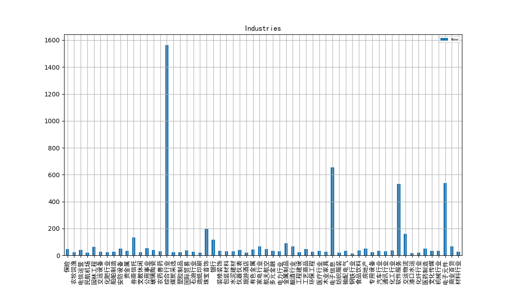

# finance
## Preparation
1. download SimHei.tff.
2. copy SimHei.tff to `Anaconda3/Lib/site-packages/matplotlib/mpl-data/fonts/ttf`.
3. change the following rows in file `matplotlibrc` in `Anaconda3/Lib/site-packages/matplotlib/mpl-data``.
    ```
    #font.family: sans-serif
    #font.sans-serif: SimHei, ...
    #axes.unicode_minus:False
    ```
4. reload matplotlib font by
    ```
    from matplotlib.font_manager import _rebuild
    _rebuild()
    ```

## Industries



The comprehensive industry has the highest averaged value.

