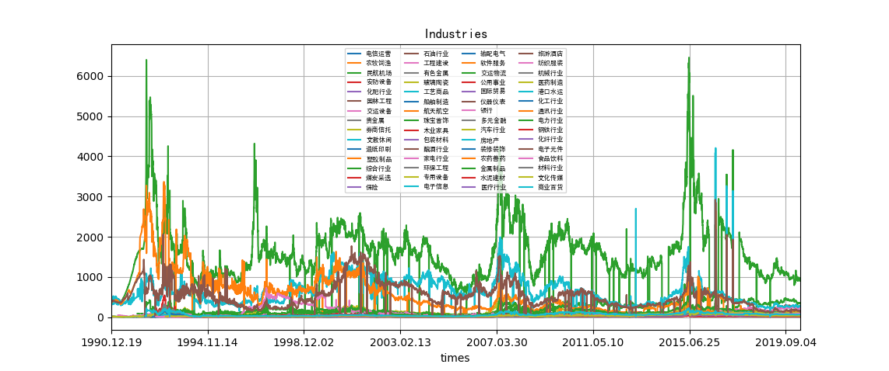

# finance
## Data Scraping

### Industries

Comparison of total market values among industries in China

<!---The comprehensive industry has the highest averaged value.--->

<!--- --->

### Industry Scope

In stock.py, there is a GUI application which can selectively show different industries in the past 100 days.

The values are calculated by averaging all stocks for each day.

## Data Analysis

### Stock Transformer

The subproject is aimed to apply transformer-model in field of natural language processing to the stock prediction.

The training loss decreases with epochs.

